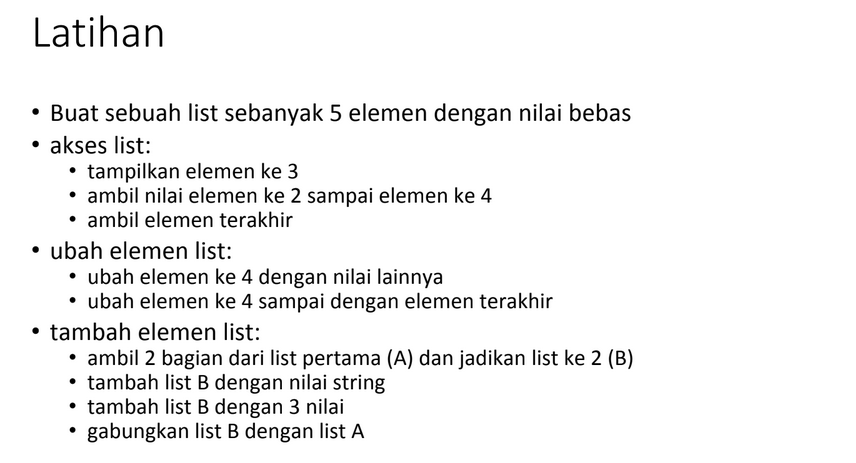

# Latihan Pertemuan 9
Pada pertemuan-9 ini saya dari kelas TI.21.C.5 diberikan tugas oleh Dosen untuk mengerjakan latihan 
pada modul praktikum 4 saya diberi soal latiihan seperti dibawah :



pertama adalah membuat list dengan 5 elemen saya membuat list

````py
    a = [6, 7, 8, 9, 10]
````

kedua pada akses list saya diberi 3 soalan

>1.Menampilkan elemen ke 3<br>
>2.Ambil nilai elemen ke 2 sampai elemen ke 4<br>
>3.Ambil elemen terakhir

dari soal diatas saya mengerjakan dengan cara sebagai berikut:

 ````py
     1. a[2]
     2. del a[1:4]
        print(a)
     3. del a[1] 
        print(a)
````

ketiga pada ubah element list saya diberikan 2 soalan

>1.ubah elemen ke 4 dengan nilai lainnya<br>
>2.ubah elemen ke 4 sampai dengan elemen terakhir<br>

dari soalan diatas saya menjawab dengan cara sebagai berikut:

````py
    a [3] = 5
    print (a)
    a [3:5] = 3, 4
    print(a)
````

terakhir pada tambah elemen list saya diberi soalan sebagai berikut

>1.Ambil 2 bagian dari list pertama (A) dan jadikan list ke 2 (B)
>2.Tambah list B dengan nilai string
>3.Tambah list B dengan 3 nilai
>4.gabungkan list B dengan list A

dari soal diatas saya menjawab dengan cara sebagai berikut:
 
````py
    b = []
    b.extend (a[0:2])
    print(b)
    b.append ('delapan')
    print(b)
    b.extend([9, 10, 11])
    print(b)
    c=a+b
    print(c)
````

berikut ini adalah screenshot pada visual studio code 


### Outputnya 


dari soal diatas saya menjawab dengan cara sebagai berikut:
# Tugas Praktikum Pertemuan 9
<hr>

Pada pertemuan-9 ini saya dari kelas TI.21.C.5 diberikan tugas oleh Dosen untuk  menginput data kedalam list.
Berserta [flowchart, ](flowchart.pdf) dan contoh tugas yang di berikan pada pertemuan-9 <br>

 

<hr>

### Berikut Inputannya : 
<hr>

``` python
nilai = []
ulang = True

while ulang:
    nama = input("Masukkan Nama: ")
    nim = input("Masukkan NIM: ")
    tugas = int(input("Masukkan Nilai Tugas: "))
    uts = int(input("Masukkan Nilai UTS: "))
    uas = int(input("Masukkan Nilai UAS: "))
    akhir = (tugas * 30/100) + (uts * 35/100) + (uas * 35/100)

    nilai.append([nama, nim, tugas, uts, uas, int(akhir)])
    if (input("Tambah data (y/t)?") == 't'):
        ulang = False

print("\n                      Daftar Nilai Mahasiswa")
print("==================================================================")
print("|No. |     Nama     |    NIM    | Tugas |  UTS  |  UAS  |  Akhir |")
print("==================================================================")
i = 0
for item in nilai:
    i += 1
    print("| {no:2d} | {nama:12s} | {nim:9s} | {tugas:5d} | {uts:5d} | {uas:5d} | {akhir:6.2f} |"
          .format(no=i, nama=item[0], nim=item[1], tugas=item[2], uts=item[3], uas=item[4], akhir=item[5]))
print("==================================================================")
````

#### Penjelasan:
1.) Pertama kita membuat variable list kosong.

```` py
nilai = []
ulang = True
````

    Variable ulang = True digunakan untuk mengontrol perulangan.

2.) Lalu kita membuat kondisi perulangan dan statement yang akan dijalankan ketika perulangan terjadi.

```` python
while ulang:
    nama = input("Masukkan Nama: ")
    nim = input("Masukkan NIM: ")
    tugas = int(input("Masukkan Nilai Tugas: "))
    uts = int(input("Masukkan Nilai UTS: "))
    uas = int(input("Masukkan Nilai UTS: "))
    akhir = (tugas * 30/100) + (uts * 35/100) + (uas * 35/100)

    nilai.append([nama, nim, tugas, uts, uas, int(akhir)])
````

    Dari statement diatas, kita akan diminta untuk menginput nama, nim, nilai tugas, nilai uts, dan nilai uas, 
    lalu system akan menjumlahkan nilai-nilai tersebut dan menghasilkan nilai akhir.
    Setelah menginput berbagai data atau item, inputan item tersebut akan masuk ke dalam list 'nilai'

3.) Setelah membuat perulangan, kita membuat statement untuk menghentikan atau keluar dari perulangan yang terjadi.

```` python
    if (input("Tambah data (y/t)?") == 't'):
        ulang = False
````

    Untuk keluar dari perulangan kita hanya perlu menginputkan t apabila diminta pada saat program dijalankan.
    t akan membuat variable ulang = True menjadi ulang = False yang mana akan menghentikan perulangan yang terjadi.

4.) Terakhir kita akan mencetak hasil dari program yang telah dibuat.

```` python
print("\n                      Daftar Nilai Mahasiswa")
print("==================================================================")
print("|No. |     Nama     |    NIM    | Tugas |  UTS  |  UAS  |  Akhir |")
print("==================================================================")
i = 0
for item in nilai:
    i += 1
    print("| {no:2d} | {nama:12s} | {nim:9s} | {tugas:5d} | {uts:5d} | {uas:5d} | {akhir:6.2f} |"
          .format(no=i, nama=item[0], nim=item[1], tugas=item[2], uts=item[3], uas=item[4], akhir=item[5]))
print("==================================================================")
````
Berikut hasil dari program data mahasiswa 

